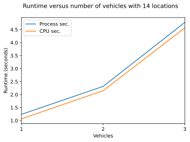

# SYDE 411 Optimization Project

## Team members:

- Sammy Robens-Paradise, 20709541
- Wassim Maj , 21048694
- Tim He, 20779429
- <full_name> , <student_number>


## Import Dependencies

Dependencies are `numpy` `matplotlib` and `scipy`. You can install both dependencies (assuming you have `Python >= 3` ) using pip:

- `pip install numpy`
- `pip install matplotlib`
- `pip install scipy`
- `pip install pulp`


```python
import numpy as np
import matplotlib.pyplot as plt
from matplotlib.ticker import MaxNLocator
import pulp

np.random.seed(18945)
# Some formating options
%config InlineBackend.figure_formats = ['svg']
```

## Problem Definition

The problem will be formulated as follows: Given 1 bus with a maximum capacity, $m$, we want to minimize the distance that the bus has to travel to $n$ locations (nodes) to pick up a total number of $P$ Our objective function is to minimize the total distance travelled, which is in turn a function of the distance to each location and the whether the locaction is connected to another location. This is commonly referred to as the **Vehicle Routing Problem**


## Problem to Minimize

For **K** vehicles where $K=\{1,2,...,k\}, k \gt 0$:

$G=(V,E)$ is a graph of the location and routes of the vehicles

$V=\{0,1,...n\}$ is a collection of nodes (locations) where $n_0$ is the start and end location for $K$ vehicles

$E$ is the set of edges $e_{ij} = (i,j)$ connecting each node

$c_{ij}$ is the cost (distance) between $i$ and $j$

### Variables:

$x_{ij}=
\begin{cases}
1: \text{the path goes from city i to j}\\
0: \text{otherwise}
\end{cases}$

$u_i - u_j + C*x_{ij} \leq C - d_j, C = N/K$
$\begin{cases}
u_i: \text{order that site i is visited}\\
d_j: \text{the cost to visit city j}, 0 \leq u_i \leq C - d_j, \forall i \in V \setminus \{0\}
\end{cases}$

### Objective Function:

(1) - $min\sum_{i=0}^{n}\sum_{j\neq{i}, j=0}^{n}{c_{ij}}{x_{ij}}$
$\begin{cases}
c_{ij}: \text{distance from city i to city j}\\
x_{ij}: \text{whether there's a path between i and j}
\end{cases}$

### With the following constraints:

(2) - $\sum_{i\in{V}}{x_{ij} = 1}, \forall j \in V \setminus \{0\}$

(3) - $\sum_{j\in{V}}{x_{ij} = 1}, \forall i \in V \setminus \{0\}$

(4) - $\sum_{i\in{V}}{x_{i0} = K}$

(5) - $\sum_{j\in{V}}{x_{0j} = K}$

### Where
- (1) is the _objective function_ 
- (2,3) constrains the (1)such that a location that is not the start and end location can only be visited by one vehicle
- (4) constrains (1) such that the start location is the first and that every vehicle starts there.
- (5) constrains (1) problem such the last location is the same as the first location and every vechicle must end there.


## Define Default Problem Constants


```python
# CONSTANTS

# delare constants to seed the data model
# the number of locations EXCLUDING the central starting and ending location
NUM_LOCATIONS = 14
NUM_VEHICLES = 2
GRID_SIZE = {"x": 1000, "y": 1000}
SEED = 18945
CENTRAL_LOCATION="Central Location"


# possible distances are
# - "manhattan"
# - "euclidean"
# - "chebyshev"
DISTANCE_METHOD = "manhattan"
```

## Create Help Methods


```python
def distance(
    p1,
    p2,
    method="manhattan",
):
    """Calculate the distance between two 2D points

    Parameters:
        p1 (ndarray) length == 2
        p2 (ndarray) length == 2
        method (string) "manhattan" | "euclidean" | "chebyshev"

    Returns:
        d (int) 2D distance between p1 and p2
    """
    # make sure that the distance is between only a coordinate
    assert len(p1) == len(p2) == 2
    x1 = p1[0]
    y1 = p1[1]
    x2 = p2[0]
    y2 = p2[1]

    d = 0
    # if the locations are the same then we can automatically say the distance is 0
    if x1 == x2 and y1 == y2:
        return d
    if method == "manhattan":
        d = np.absolute(x1 - x2) + np.absolute(y1 - y2)
    elif method == "euclidean":
        d = np.sqrt(np.power(x2 - x1, 2) + np.power(y2 - y1, 2))
    elif method == "chebyshev":
        d = np.max([np.absolute(x2 - x1), np.absolute(y2 - y1)])
    return d


def generate_data(
    num_locations=NUM_LOCATIONS,
    grid_size=GRID_SIZE,
    seed=None,
    distance_method="manhattan",
):
    """Generate the data for a given problem

    Args:
        num_locations (_int_, optional) Defaults to NUM_LOCATIONS.
        grid_size (_dict_, optional). Defaults to GRID_SIZE.
        seed (_int_, optional). Defaults to None.
        distance_method (str, optional). Defaults to "manhattan".

    Returns:
        locations: array of locations
        distances: n by n matrix of distances to each location from each location
        annotations: array of strings annotated coordinates of each location
    """
    # seed our data so that we have reproducible data
    if seed != None:
        np.random.seed(seed)
    locations = []
    annotations = []
    central_location_coord = [0, 0]
    # the central location is taken to be (0,0)
    locations.append(central_location_coord)
    annotations.append(CENTRAL_LOCATION)
    for _ in range(num_locations):
        x_coord = np.random.randint(-1 * grid_size["x"] / 2, grid_size["x"] / 2)
        y_coord = np.random.randint(-1 * grid_size["y"] / 2, grid_size["y"] / 2)
        node_coord = [x_coord, y_coord]
        label = "(" + str(x_coord) + "," + str(y_coord) + ")"
        locations.append(node_coord)
        annotations.append(label)
    locations = np.array(locations)
    distances = []
    for c1 in locations:
        local_distance = []
        for c2 in locations:
            d = distance(c1, c2, method=distance_method)
            local_distance.append(d)
        distances.append(local_distance)

    return locations, np.array(distances), annotations


def _validate_distances_(distances):
    assert (
        distances.shape[0] == distances.shape[1] == NUM_LOCATIONS + 1
    ), "Expected Distance matrix to be square and to equal NUM_LOCATIONS + 1"
    for i, _ in enumerate(distances):
        assert distances[i][i] == 0, "Distance diagonals cannot be non-zero"


def generate_lp_problem(title="cap_vehicle_routing_roblem"):
    """Generates a PuLP problem

    Args:
        title (str, optional): _description_. Defaults to "cap_vehicle_routing_roblem".

    Returns:
        PuLP Problem: Minimization Problem `LpProblem`
    """
    return pulp.LpProblem(title, pulp.LpMinimize)


def not_none(v):
    """returns true of the value is not `None`

    Args:
        v (`Any`): value

    Returns:
        Boolean: `True` or `False`
    """
    if v != None:
        return True
    return False


def generate_x(location_count):
    """generates n*n x variables

    Args:
        location_count (`int`): location_count

    Returns:
        n x n list `x`: variables in their n x n form
        1 x (n x x) list `x_1d`: variables in their list form
    """
    x = [
        [
            pulp.LpVariable("x%s_%s" % (i, j), 0, 1, pulp.LpBinary) if i != j else None
            for j in range(location_count)
        ]
        for i in range(location_count)
    ]
    x_1d = []
    for row in x:
        for val in row:
            x_1d.append(val)
    x_1d = list(filter(not_none, x_1d))
    return x, x_1d


def generate_u(location_points):
    """generate dummy `u` variables

    Args:
        location_points (ndarray): array of strings

    Returns:
        u: array of `LpVariables`
    """
    u = [
        pulp.LpVariable("u_%s" % (name), 0, len(location_points) - 1, pulp.LpInteger)
        for name in location_points
    ]
    return u


def objective_function(problem, x, distances):
    """applys the objective function to the problem

    Args:
        problem (LpProblem): a linear programming problem
        x (ndarray): x_ij
        distances (ndarrray): distances

    Returns:
        LpProblem: `LpProblem`
    """
    distances_1d = []
    for row in distances:
        for d in row:
            if d != 0:
                distances_1d.append(d)
    sum = []
    for idx, d in enumerate(distances_1d):
        ls = x[idx] * d
        sum.append(ls)
    cost = pulp.lpSum(sum)
    problem += cost
    return problem


def constraints(problem, x, location_points, num_vehicles):
    """Apply contraints to a problem

    Args:
        problem (LpProblem): `LpProblem`
        x (ndarray): x variables
        location_points (ndarray): array of locations
        num_vehicles (int): number of vehicles

    Returns:
        problem: `LpProblem`
    """
    x_transp = np.transpose(x)
    for idx, location in enumerate(location_points):
        max_visits = 1
        if location == CENTRAL_LOCATION:
            max_visits = num_vehicles
        sum = list(filter(not_none, x[idx]))
        sum_transp = list(filter(not_none, x_transp[idx]))
        # constrain inbound connections
        problem += pulp.lpSum(sum) == max_visits
        # constrain outbound connections by taking the transpose
        # i.e x_0_1 --> x_1_0
        problem += pulp.lpSum(sum_transp) == max_visits
    return problem


def subtours(problem, x, u, location_points, num_vehicles):
    """Constrains subtours of a given VRP problem

    Args:
        problem (LpProblem): `LpProblem`
        x (ndarray): x variables
        u (ndarray): u dummy variables to handle inequalities
        location_points (ndarray): array of locations
        num_vehicles (int): number of vehicles

    Returns:
        problem: `LpProblem`
    """
    n = len(location_points) / num_vehicles
    for i, l1 in enumerate(location_points):
        for j, l2 in enumerate(location_points):
            if l1 != l2 and (l1 != CENTRAL_LOCATION and l2 != CENTRAL_LOCATION):
                problem += u[i] - u[j] <= (n) * (1 - (x[i][j])) - 1
    return problem


def find_next(start, nonstarting_edges: list, route: list):
    ### Start is xaa_bb
    ### We want to find in the list nonstarting_edges the element xbb_cc
    start = str(start)
    nonstarting_edges = nonstarting_edges
    route.append(start)

    pos = start.rfind("_")
    next_index = start[pos + 1 :]
    next_elem = "x" + next_index + "_"
    ### Go through list to find elem
    for edge in nonstarting_edges:
        newstart = None
        if next_elem in edge:
            nonstarting_edges.remove(edge)
            newstart = edge
        if newstart != None:
            find_next(newstart, nonstarting_edges, route)

    return route


def construct_routes(nonzero_edges):
    routes = []
    starting_points = []

    for element in nonzero_edges:
        name = str(element)
        if "x0" in name:
            starting_points.append(name)
    nonstarting_edges = [elem for elem in nonzero_edges if "x0" not in str(elem)]
    for start in starting_points:
        r = []
        find_next(start, nonstarting_edges, r)

        routes.append(r)
    return routes


def print_edge_paths(edge_paths):
    print("=== OPTIMAL EDGE PATHS ===")
    for v, result in enumerate(edge_paths):
        print("Vehicle " + str(v + 1) + " Path:")
        print(result)


def print_node_paths(node_paths):
    print("=== OPTIMAL NODE PATHS ===")
    for v, path in enumerate(node_paths):
        path_string = ""
        for j, node in enumerate(path):
            if j != len(path) - 1:
                path_string += node + " --> "
            else:
                path_string += node
        print("Vehicle " + str(v + 1) + " Path:")
        print(path_string)


def plot_results(edge_paths, locations, distance_method=DISTANCE_METHOD, problem=None):
    if problem != None:
        problem.plot_locations()

    plt.scatter(x=0, y=0, marker=",", color="k", zorder=3)
    colors = ["r", "g", "b", "c", "m", "y"]
    i = 0
    for vehicle_path in edge_paths:
        ligns = str(colors[i] + "o-")

        for point in vehicle_path:
            point = str(point)
            # point ~ "xaa_bb"
            position = point.rfind("_")

            start = int(point[1:position])
            end = int(point[position + 1 : len(point)])

            x1 = [locations[start][0], locations[end][0]]
            y1 = [locations[start][1], locations[end][1]]

            if distance_method == "manhattan":
                plt.step(x1, y1, ligns, zorder=2)
            else:  # elif distance_method == "euclidean" :
                plt.plot(x1, y1, ligns, zorder=2)

        # Add the lign from last point back to the central station
        x1 = [locations[end][0], locations[0][0]]
        y1 = [locations[end][1], locations[0][1]]
        if distance_method == "manhattan":
            plt.step(x1, y1, ligns, label=f"Vehicle {i+1}", zorder=1)
        else:  # elif distance_method == "euclidean" :
            plt.plot(x1, y1, ligns, label=f"Vehicle {i+1}", zorder=1)

        i = 0 if i + 1 > len(colors) else i + 1

    plt.legend()
    plt.show()
    return None
```

## Class Definition
Create a class `Problem` so that we can create multiple problems with various test iteratively and dynmaically
It can then be used as
```py

locations, distances, annotations = generate_data(
    num_locations=NUM_LOCATIONS,
    grid_size=GRID_SIZE,
    seed=SEED,
    distance_method=DISTANCE_METHOD,
)

problem = Problem(locations=locations, distances=distances, annotations=annotations)
```


```python
# PROBLEM CLASS DEFINITION
class Problem:
    def __init__(
        self,
        num_locations: int = NUM_LOCATIONS,
        num_vehicles: int = NUM_VEHICLES,
        grid_size: dict = GRID_SIZE,
        seed: int = SEED,
        id: int = 1,
        locations: list or None = None,
        distances: list or None = None,
        annotations: list or None = None,
    ):
        """VRP Problem Class

        Args:
            num_locations (int, optional): _description_. Defaults to NUM_LOCATIONS.
            num_vehicles (int, optional): _description_. Defaults to NUM_VEHICLES.
            grid_size (dict, optional): _description_. Defaults to GRID_SIZE.
            seed (int, optional): _description_. Defaults to SEED.
            id (int, optional): _description_. Defaults to 1.
            locations (listorNone, optional): _description_. Defaults to None.
            distances (listorNone, optional): _description_. Defaults to None.
            annotations (listorNone, optional): _description_. Defaults to None.
        """

        self.id = id
        self.is_solved = False
        self.num_locations = num_locations
        self.num_vehicles = num_vehicles
        self.grid_size = grid_size
        self.seed = seed
        self.routes = None
        self.paths = None

        _validate_distances_(distances)
        assert (
            len(locations) == self.num_locations + 1
        ), "Error: Incorrect number of locations created"

        self.distances = distances
        self.locations = locations
        self.annotations = annotations

        # create a Linear Programming Optimization problem
        self.problem = generate_lp_problem()

        # generate binary variable x
        x, x_1d = generate_x(len(locations))
        self.x = x

        # linearize x into a 1D array to make the math easier
        self.x_1d = x_1d

        # generate dummy variable u to eliminate subtours
        u = generate_u(self.annotations)
        self.u = u

        # add objective function to our problem
        self.problem = objective_function(self.problem, x_1d, distances)

        # apply constrains to our objective function
        self.problem = constraints(
            self.problem, self.x, self.annotations, self.num_vehicles
        )

        # apply constraints to remove subtours
        self.problem = subtours(self.problem, x, u, self.annotations, self.num_vehicles)

    def minimize(self, method="default"):
        if method == "simplex":
            self.problem.solve(pulp.apis.GLPK(options=["--simplex"]))
        elif method == "default":
            self.problem.solve(pulp.apis.PULP_CBC_CMD(msg=0, warmStart=True))
        self.is_solved = True
        return pulp.LpStatus[self.problem.status], self.problem

    def plot_locations(self):
        plt.figure()
        plt.suptitle("Scatter plot of locations for problem: " + str(self.id))
        plt.grid()
        colors = np.random.rand(len(self.locations))
        plt.scatter(self.locations[:, 0], self.locations[:, 1], c=colors)
        plt.xlabel("$x$ m")
        plt.ylabel("$y$ m")
        plt.xlim([-1 * self.grid_size["x"] / 2, self.grid_size["x"] / 2])
        plt.ylim([-1 * self.grid_size["y"] / 2, self.grid_size["y"] / 2])
        for i, label in enumerate(self.annotations):
            plt.annotate(label, (self.locations[:, 0][i], self.locations[:, 1][i]))

    def state(self):
        print("Minimization problems for problem of id: " + str(self.id))
        print(self.problem)

    def edge_paths(self):
        if self.is_solved == True:
            nonzero_edges = []
            for row in self.x:
                for edge in row:
                    if edge != None and pulp.value(edge) > 0:
                        nonzero_edges.append(edge)
            nonzero_edges = [str(a) for a in nonzero_edges]
            routes = construct_routes(nonzero_edges)
            self.routes = routes
            return routes
        else:
            print("No valid solution")
            return None

    def node_paths(self):
        if self.is_solved == True:
            if self.routes == None:
                # create the edge paths if we haven't yet done that
                self.edge_paths()
            n_paths = []
            for route in self.routes:
                path = []
                for idx, edge in enumerate(route):
                    edge_name_list = list(str(edge))
                    cur_index = int(edge_name_list[1])
                    node = self.annotations[cur_index]
                    path.append(node)
                    if idx == len(route) - 1:
                        next_index = int(edge_name_list[len(edge_name_list) - 1])
                        end_node = self.annotations[next_index]
                        path.append(end_node)

                path.append(self.annotations[0])
                n_paths.append(path)
            self.paths = n_paths
            return n_paths
        else:
            print("No valid solution")
            return None

    def _get_locations(self):
        return self.locations

    def _get_problem(self):
        return self.problem

    def _get_distances(self):
        return self.distances

    def _get_x(self):
        return self.x, self.x_1d

    def _get_u(self):
        return self.u

    def _get_annotations(self):
        return self.annotations
```

## Create Input Data


```python
locations, distances, annotations = generate_data(
    num_locations=NUM_LOCATIONS,
    grid_size=GRID_SIZE,
    seed=SEED,
    distance_method=DISTANCE_METHOD,
)
```

## Create Problem and Solve


```python
P1 = Problem(locations=locations, distances=distances, annotations=annotations)
P1.plot_locations()
P1.minimize(method="default")
edge_paths = P1.edge_paths()
node_paths = P1.node_paths()
plot_results(edge_paths, P1.locations)
```


    

    


## Conducting Problem Analysis

We want to solve a number of different problems to see how they scale and how the perfomance of the algorithm changes over time

### Performance while scaling the number of vehicles
Scaling the number of vehicles using the default [Branch and Cut Method](https://www.coin-or.org/Cbc/ch01s04.html) Method


```python
num_vehicles = [1, 2, 3]
locations, distances, annotations = generate_data(
    num_locations=NUM_LOCATIONS,
    grid_size=GRID_SIZE,
    seed=SEED,
    distance_method=DISTANCE_METHOD,
)

problems: list[Problem] = []
process_times: list[float] = []
process_cpu_times: list[float] = []

for idx, vehicles in enumerate(num_vehicles):
    problem = Problem(
        locations=locations,
        distances=distances,
        annotations=annotations,
        num_vehicles=vehicles,
        id=idx + 1,
    )
    problems.append(problem)

for problem in problems:
    problem.plot_locations()
    _, state = problem.minimize(method="default")
    process_times.append(state.solutionTime)
    process_cpu_times.append(state.solutionCpuTime)
    edge_paths = problem.edge_paths()
    node_paths = problem.node_paths()
    plot_results(edge_paths, problem.locations)
```


    

    


    

    


    

    


### Solution-Time Versus number of vehicles
We want to see how the number of vehicles relates to the runtime of the solution using the **Branch and Cut** Method


```python
f = plt.figure()
ax = f.gca()
plt.suptitle(
    "Runtime versus number of vehicles with " + str(NUM_LOCATIONS) + " locations"
)
x = plt.plot(num_vehicles, process_times, label="Process sec.")
y = plt.plot(num_vehicles, process_cpu_times, label="CPU sec.")
ax.xaxis.set_major_locator(MaxNLocator(integer=True))
plt.xlabel("Vehicles")
plt.ylabel("Runtime (seconds)")
plt.legend(labels=[], handles=[x])
plt.xlim([num_vehicles[0], num_vehicles[len(num_vehicles) - 1]])
plt.show()
```


    

    

